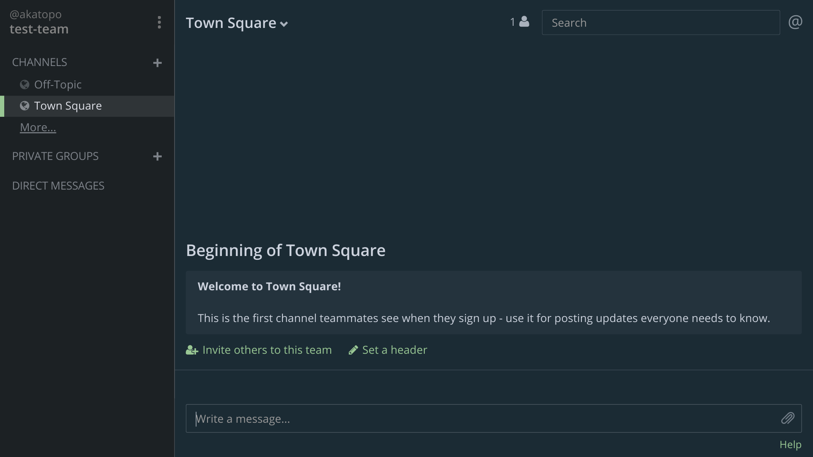
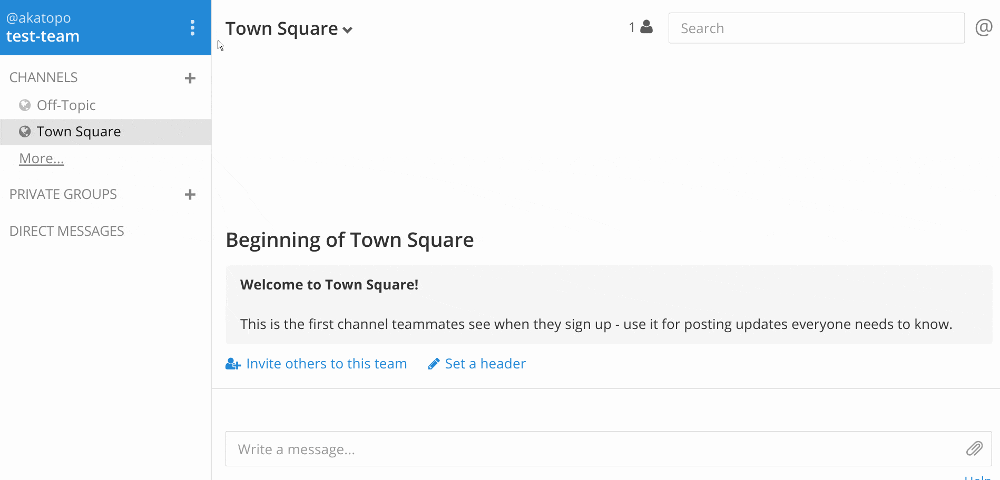

# :ocean: mattermost-theme-oceanish

A dark theme for [mattermost](http://www.mattermost.org/), uses colors from [oceanic next](https://github.com/voronianski/oceanic-next-color-scheme).



## Installing



* Click on the upper left corner tripple dot menu button
* Go to `Account Settings > Display` (`Account Settings > Appearance` for older versions)
* Select `Theme` then `Custom Theme` (just `Custom Theme` for older versions)
* Paste this into the box labeled `Copy and paste to share theme colors` and click `Save`:

**For mattermost v4 (tested 4.1)**

```json
{ "sidebarBg":"#1c2124", "sidebarText":"#c0c5ce", "sidebarUnreadText":"#dfe1e8", "sidebarTextHoverBg":"#4A5664",
  "sidebarTextActiveBorder":"#99c794", "sidebarTextActiveColor":"#dfe1e8", "sidebarHeaderBg":"#1c2124",
  "sidebarHeaderTextColor":"#c0c5ce", "onlineIndicator":"#99c794", "awayIndicator":"#FAC863", "mentionBj":"#dfe1e8",
  "mentionColor":"#1b2b34", "centerChannelBg":"#1b2b34", "centerChannelColor":"#cdd3de", "newMessageSeparator":"#5de5da",
  "linkColor":"#99c794", "buttonColor":"#dfe1e8", "buttonBg":"#1a4666", "mentionHighlightBg":"#cdd3de",
  "mentionHighlightLink":"#99c794", "codeTheme":"solarized-dark" }
```

**For mattermost v2 (tested on 2.1 and 2.2)**

```
#1c2124,#c0c5ce,#1c2124,#868686,#dfe1e8,#4A5664,#99c794,#dfe1e8,#99c794,#1b2b34,#dfe1e8,#1b2b34,#1b2b34,#cdd3de,#5de5da,#515a65,#cdd3de,#99c794,#1a4666,#dfe1e8,solarized-dark
```

**For older versions of mattermost (tested on 1.4)**

```
#1c2124,#c0c5ce,#1c2124,#868686,#dfe1e8,#4A5664,#99c794,#dfe1e8,#99c794,#1b2b34,#dfe1e8,#1b2b34,#cdd3de,#5de5da,#99c794,#1a4666,#dfe1e8,#515a65,#cdd3de,solarized_dark
```
