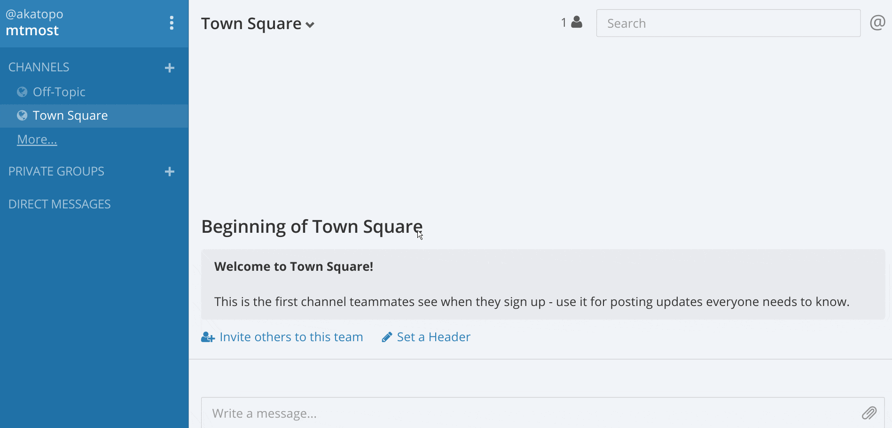

# :ocean: mattermost-theme-oceanish

A dark theme for [mattermost](http://www.mattermost.org/), uses colors from [oceanic next](https://github.com/voronianski/oceanic-next-color-scheme).


## Installing



* Click on the upper left corner tripple dot menu button
* Go to `Account Settings > Appearance`
* Select `Custom Theme`
* Paste this into the box labeled `Copy and paste to share theme colors` and click `Save`:

```
#1c2124,#c0c5ce,#1c2124,#868686,#dfe1e8,#4A5664,#99c794,#dfe1e8,#99c794,#1b2b34,#dfe1e8,#1b2b34,#cdd3de,#5de5da,#99c794,#1a4666,#dfe1e8,#515a65,#cdd3de,solarized_dark
```